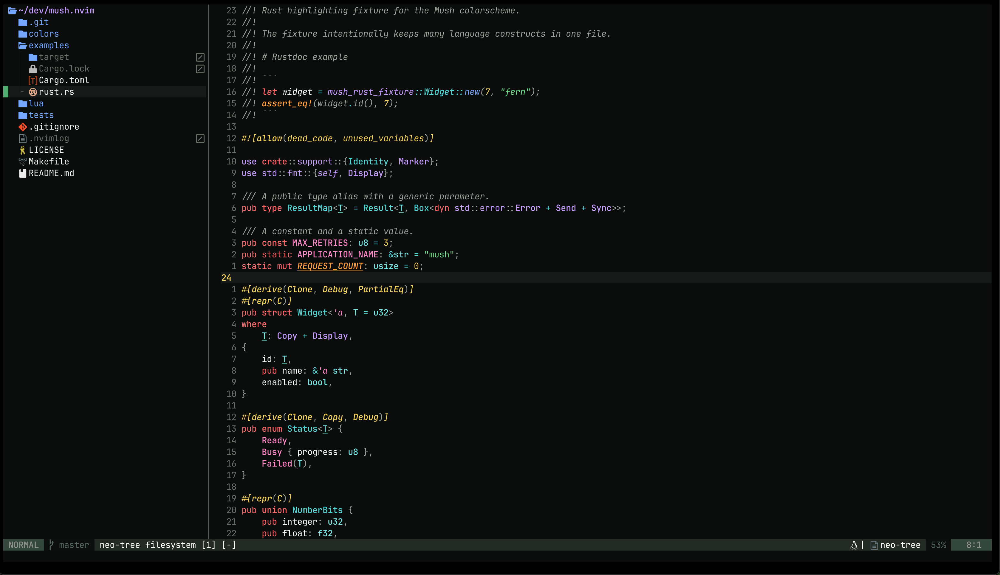
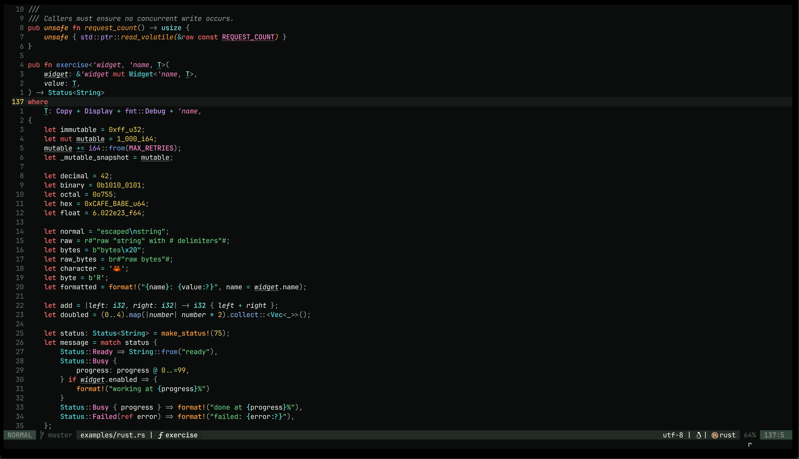
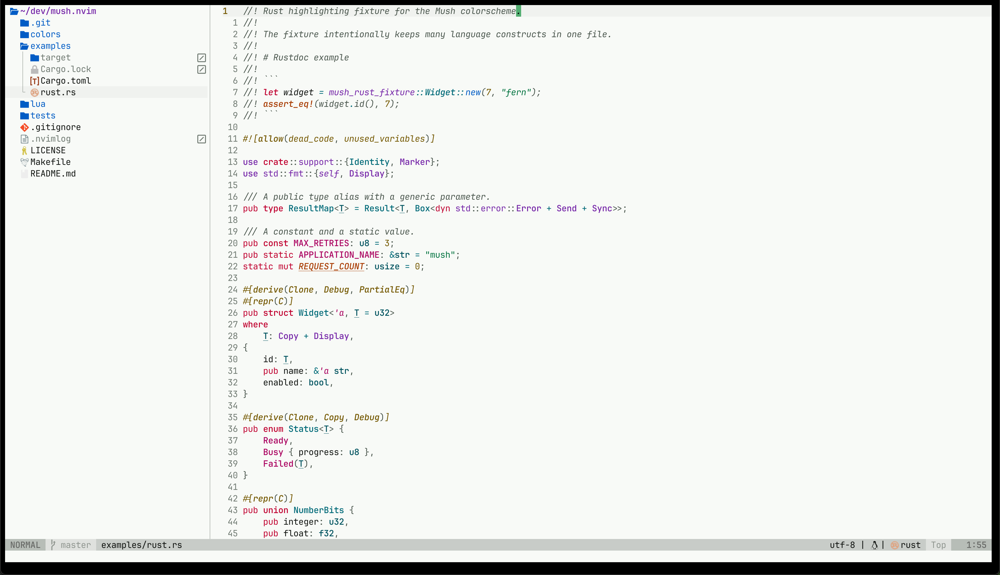
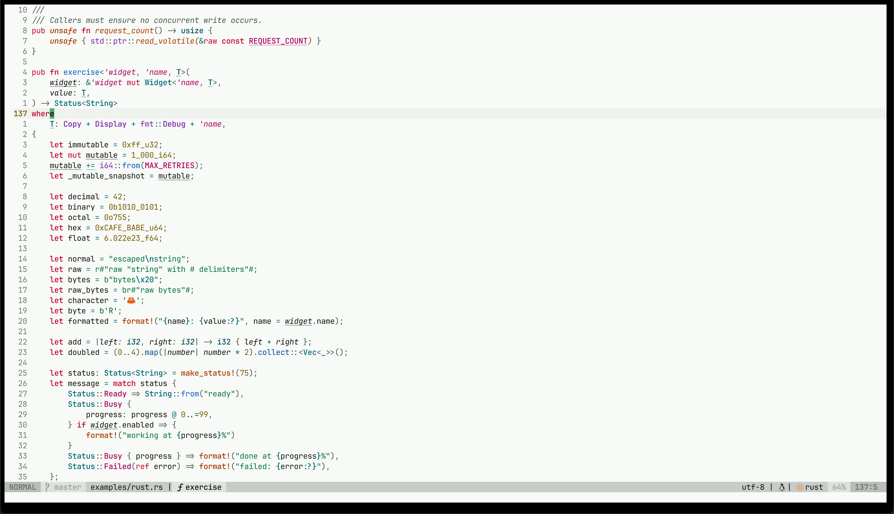

# mush.nvim

A high-contrast Neovim colorscheme with coordinated dark and light variants,
careful Rust highlighting, and no runtime dependencies.

Mush uses near-black and near-white foundations with bright moss, rust, amber,
cyan, blue, violet, pink, and red accents. The light variant uses deep,
jewel-toned accents rather than pastels. Both variants preserve the same
semantic color language, so switching themes does not require relearning what
each color means.

## Screenshots

### Mush dark





### Mush light





## Requirements

- Neovim 0.11 or newer
- A terminal or GUI with true-color support is recommended

Mush does not enable `termguicolors`, change `background`, or require
Tree-sitter, an LSP client, or any supported UI plugin. It includes 256-color
fallbacks for terminals where `termguicolors` is disabled.

## Installation

### lazy.nvim

```lua
{
  "Tawxyn/mush.nvim",
  lazy = false,
  priority = 1000,
  config = function()
    require("mush").setup()
    vim.cmd.colorscheme("mush-dark")
  end,
}
```

### vim.pack

`vim.pack` is available in Neovim 0.12 and newer. The colorscheme itself still
supports Neovim 0.11.

```lua
vim.pack.add({
  "https://github.com/Tawxyn/mush.nvim",
})

require("mush").setup()
vim.cmd.colorscheme("mush-dark")
```

### vim-plug

```vim
call plug#begin()
Plug 'Tawxyn/mush.nvim'
call plug#end()

colorscheme mush-dark
```

### Manual package

Clone Mush into a `start` package directory:

```sh
git clone https://github.com/Tawxyn/mush.nvim \
  "${XDG_DATA_HOME:-$HOME/.local/share}/nvim/site/pack/colors/start/mush.nvim"
```

Then load either variant from `init.lua`:

```lua
vim.cmd.colorscheme("mush-dark")
-- or:
vim.cmd.colorscheme("mush-light")
```

Both colorschemes work without calling `setup()`.

## Configuration

Call `setup()` before `:colorscheme` to change the defaults:

```lua
require("mush").setup({
  transparent = false,
  terminal_colors = true,
  styles = {
    comments = { italic = true },
    keywords = { bold = true },
    functions = { bold = false },
  },
})

vim.cmd.colorscheme("mush-dark")
```

Options:

| Option | Default | Description |
| --- | --- | --- |
| `transparent` | `false` | Clears editor, sign-column, end-of-buffer, and winbar backgrounds. Elevated floats and menus remain opaque. |
| `terminal_colors` | `true` | Sets Neovim's 16 `terminal_color_*` globals to the active Mush palette. |
| `styles.comments` | `{ italic = true }` | Highlight attributes applied to comments. |
| `styles.keywords` | `{ bold = true }` | Highlight attributes applied to keywords. |
| `styles.functions` | `{ bold = false }` | Highlight attributes applied to functions. |

Every `setup()` call starts from the documented defaults. This prevents omitted
values from a previous call leaking into later configuration.

Mush deliberately leaves `vim.o.background`, `vim.o.termguicolors`, and other
user options untouched, even when switching between variants.

## Rust highlighting

The Rust palette is designed to keep these categories visually distinct:

- types and structs use cyan; traits use violet; type parameters use bright
  cyan with an underline
- functions use blue, methods use brighter blue, and macros use bold rust
- enum variants and read-only semantic values use pink
- mutable semantic tokens are underlined while immutable values remain plain
- lifetimes use italic pink and loop labels use italic rust
- attributes use amber and macros, rather than comment styling
- unsafe semantic tokens use restrained italic rust
- `self`, `Self`, `crate`, modules, primitive types, and format specifiers have
  intentional mappings

Generic Tree-sitter captures provide syntax structure. rust-analyzer semantic
tokens refine symbol meaning when an LSP is attached; neither integration is
required for the colorscheme to load.

[`examples/rust.rs`](examples/rust.rs) covers structs, enums, unions, aliases,
traits, bounds, generics, associated types, functions, methods, closures,
async, mutable and immutable values, constants, statics, lifetimes, macros,
attributes, modules, patterns, unsafe code, FFI, Rustdoc, string forms,
numeric literals, and Rust's special path keywords.

To inspect the fixture in Neovim:

```vim
:edit examples/rust.rs
:Inspect
:InspectTree
```

The fixture is also a small Cargo project:

```sh
cargo check --manifest-path examples/Cargo.toml
```

## Plugin highlights

Mush defines lightweight highlight groups for:

- Telescope
- blink.cmp and nvim-cmp
- Gitsigns
- Neo-tree and nvim-tree
- Which-key
- Trouble

These definitions do not load, detect, or require the plugins.

## Testing

Run the dependency-free headless suite with:

```sh
make test
```

The suite verifies direct loading, `colors_name`, representative highlight
groups, repeated switching, transparent and opaque modes, terminal colors,
configuration reset behavior, user-option preservation, and loading without
optional providers or plugins.

## License

Mush is available under the [MIT License](LICENSE).
